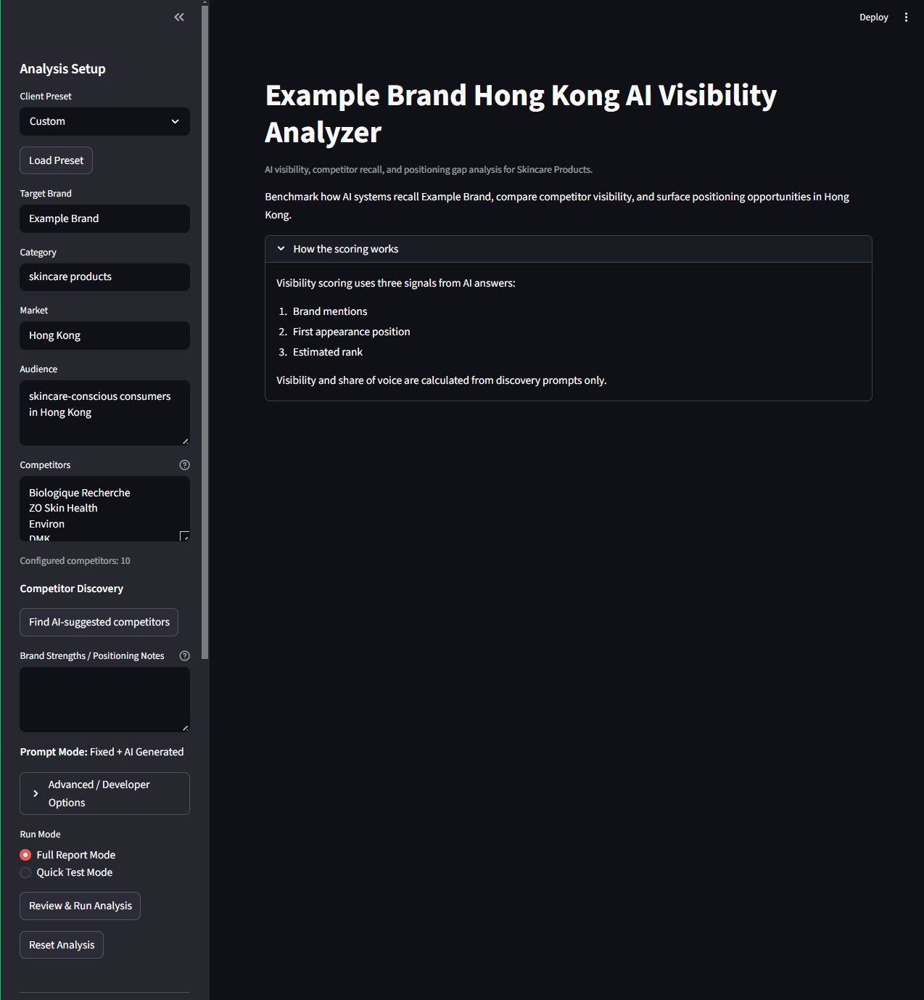
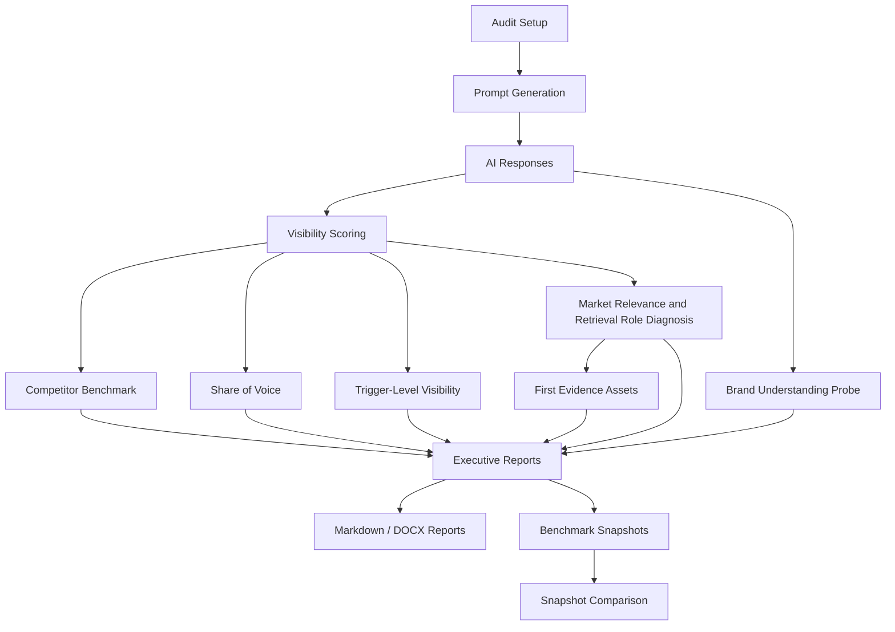

# AI Recommendation Readiness Diagnosis

Why does AI recommend competitors instead of your brand — and what evidence should you build first?

This local-first Streamlit app benchmarks whether a target brand enters AI recommendation candidate sets, identifies which competitors are retrieved instead, and turns zero-visibility findings into source-grounded evidence-building priorities.

It is designed for Generative Engine Optimization (GEO), AI visibility audits, and productized consulting workflows where the main question is not just “was my brand mentioned?”, but:

- Does AI understand what the brand does?
- Does the brand enter recommendation-style answers?
- Which competitors are retrieved instead?
- What retrieval roles do those competitors appear to satisfy?
- Which source-supported evidence gaps may explain why the target brand is missing?
- What are the first evidence assets to build and validate?

The app runs locally and requires your own OpenAI API key. It is not a hosted SaaS product.

---

## Product Workflow

```mermaid
flowchart LR
    A[Run recommendation-style AI benchmark] --> B[Measure target-brand visibility]
    B --> C[Identify retrieved reference brands]
    C --> D[Diagnose retrieval roles and target gaps]
    D --> E[Add optional source evidence JSON or CSV]
    E --> F[Preview source-grounded evidence gaps]
    F --> G[Export Markdown and DOCX reports]
    G --> H[Build first evidence assets and rerun benchmark]
```



The workflow separates observed benchmark signals from source-grounded evidence validation. The benchmark shows which brands appear in AI recommendation-style answers; the optional source evidence layer helps explain which evidence gaps should be investigated before building new content assets.

Source evidence JSON and CSV inputs are currently analyst-controlled formats for research, demo validation, and future automation support. They are not positioned as the final client-facing input experience.

---

## Product Screenshots

Screenshots will be added to show the end-to-end product workflow:

1. Benchmark setup
2. Results dashboard
3. Source Evidence Preview with JSON / CSV upload
4. Export Reports with Markdown and DOCX outputs
5. Example Recommendation Readiness report output

Planned screenshot assets:

| Screenshot | Purpose |
| --- | --- |
| Benchmark setup | Shows how the target brand, market, category, audience, and competitors are configured. |
| Results dashboard | Shows visibility metrics, retrieved brands, and benchmark findings. |
| Source Evidence Preview | Shows optional source evidence validation using JSON or CSV inputs. |
| Export Reports | Shows Markdown / DOCX export options. |
| Report output | Shows the generated Recommendation Readiness diagnosis. |

---

## Product Demo

The public demo shows a fictional zero-visibility audit where the target brand is not recommended, but competing brands are retrieved.

Start here:

- [Demo Executive Report](examples/demo-executive-report.md): fictional Recommendation Readiness report with source-grounded evidence summary.
- [Source Evidence Demo Report](examples/source-evidence-demo-report.md): deterministic fixture-based evidence gap report.
- [Source Evidence Summary](examples/source-evidence-summary.md): reusable CLI-rendered source evidence summary section.
- [Skincare Source Evidence Summary](examples/skincare-source-evidence-summary.md): fictional vertical demo for local skincare recommendation evidence gaps.
- [Source Evidence Demo Fixture](examples/source-evidence-demo.json): fictional source evidence input data.
- [Output Examples](docs/output-examples.md): overview of generated report sections and benchmark artifacts.
- [Methodology](docs/methodology.md): scoring approach, benchmark assumptions, and interpretation guidance.
- [Product Roadmap](docs/product-roadmap.md): current product direction, completed foundations, and next development phases.
- [Architecture Overview](docs/architecture-overview.md): high-level pipeline from prompt benchmark to report output.
- [Source Evidence Schema](docs/source-evidence-schema.md): manual JSON format for source-grounded evidence records.

The demo is not live client data, confidential brand data, automated web research, or a Quick Test Mode result.

---

## Dashboard Preview



The dashboard supports configurable brand audits, competitor benchmarking, visibility scoring, recommendation-readiness diagnostics, evidence asset planning, and exportable reports.

---

## Why This Matters

Search behavior is shifting from traditional blue-link search results toward AI-generated answers. When users ask AI systems for recommendations, comparisons, alternatives, local options, or decision criteria, brands may or may not enter the generated candidate set.

Traditional SEO tools do not fully explain:

- Whether a brand appears in AI-generated recommendation answers
- Which brands are retrieved instead
- Which query types trigger competitor visibility
- Which retrieval roles visible brands appear to occupy
- Which evidence gaps may prevent candidate-set inclusion
- Which evidence assets should be built and validated first

This project explores how AI visibility can be measured, benchmarked, and translated into practical recommendation-readiness diagnosis.

---

## What This Tool Measures

The tool benchmarks a target brand against tracked competitors across recommendation-style prompts, then diagnoses whether the target is ready to be retrieved and recommended in the tested category, market, and audience context.

It measures:

- **Total mentions**: how often each tracked brand appears
- **Average visibility score**: a score based on mention presence, first appearance, and estimated rank
- **Prompts visible**: how many tested prompts mention the brand
- **Share of voice**: each brand's share of tracked brand mentions
- **Trigger-level visibility**: which query categories each brand wins or loses
- **Top brand winners by query type**
- **Brand understanding signals**
- **Market relevance signals**
- **Retrieved-brand roles**
- **Target-vs-retrieved brand gaps**
- **First evidence assets to build**
- **Benchmark snapshots for future comparison**

---

## Example Output

The app produces report-ready outputs in Full Report Mode, including:

- Recommendation Readiness verdict
- Brand understanding summary
- Retrieved-brand diagnosis
- Retrieval role explanation
- Target vs retrieved brand gap
- First evidence assets to build
- Validation plan for future benchmark runs
- Source-grounded evidence summary
- Supporting benchmark data
- Markdown executive report
- DOCX executive report
- Benchmark snapshot JSON
- Snapshot comparison outputs

Public example materials:

- [Demo Executive Report](examples/demo-executive-report.md): fictional Recommendation Readiness report with source-grounded evidence summary.
- [Source Evidence Demo Report](examples/source-evidence-demo-report.md): deterministic fixture-based source evidence summary.
- [Source Evidence Demo Fixture](examples/source-evidence-demo.json): fictional source evidence records used by the demo renderer.
- [Output Examples](docs/output-examples.md): overview of generated report sections and benchmark artifacts.
- [Methodology](docs/methodology.md): scoring approach, benchmark assumptions, and interpretation guidance.

---

## How This Is Different

Most AI visibility tools focus on monitoring mentions across AI engines. This project is designed as a **report-first recommendation-readiness workflow**.

It is built to:

- Benchmark a target brand against tracked competitors
- Score visibility across recommendation-style prompt categories
- Identify which brands AI retrieves instead
- Diagnose retrieved-brand roles and target gaps
- Prioritize the first evidence assets to build
- Validate progress through future comparable benchmarks
- Export Markdown, DOCX, and JSON benchmark artifacts
- Support local-first usage with the user's own API key

The goal is not just to show whether a brand was mentioned. The goal is to explain why other brands may be retrieved instead, what evidence gap the target appears to have, and how to validate progress without treating benchmark inference as verified market fact.

---

## Key Features

### AI Recommendation Benchmark

Runs prompt-based tests across recommendation, comparison, local-intent, alternative, trust-signal, and decision-stage query types.

### Brand Visibility Scoring

Tracks total mentions, average visibility score, prompts visible, and share of voice.

### Competitor Benchmarking

Compares the target brand against a configurable set of tracked competitors.

### Recommendation Readiness Diagnosis

For zero-visibility brands, reframes the report around candidate-set inclusion, retrieved brands, retrieval-role hypotheses, target gaps, and the first evidence assets to build.

### Trigger-Level Visibility

Shows which competitors win specific query categories and where the target brand is missing.

### Brand Understanding and Market Relevance Probes

Uses compact diagnostic probes to distinguish brand understanding, recommendation retrieval, and market-relevance risks. Probe outputs are AI-inferred and require validation.

### First Evidence Asset Planning

Prioritizes specific evidence assets, such as entity pages, proof pages, market relevance pages, and alternatives/comparison pages, instead of generic marketing recommendations.

### Exportable Reports

Produces Markdown and DOCX executive reports for review, presentation, or portfolio demonstration.

### Benchmark Snapshots

Exports JSON benchmark snapshots for tracking visibility changes over time.

Snapshot metadata includes model name, prompt count, run mode, prompt categories, competitor set, raw-answer inclusion, and API usage summary.

### Output Quality Validation

Includes sanitation and validation logic to reduce raw LLM errors, malformed output, unsafe claim wording, inconsistent report artifacts, and unsupported benchmark claims.

### Regression Test Suite

Includes tests for scoring, report generation, output quality, benchmark snapshots, export behavior, prompts, roadmap generation, and controller logic.

---

## Example Use Cases

This tool can be used for:

- AI visibility audits for brands
- GEO / Generative Engine Optimization analysis
- Competitor visibility benchmarking
- AI SEO research
- Agency-style client diagnostics
- Founder or startup positioning research
- Market-entry visibility analysis
- Evidence asset planning
- Tracking whether evidence changes are associated with future benchmark changes
- Creating structured Recommendation Readiness reports for internal review or portfolio demonstrations

Example audit scenarios:

- A regional skincare brand vs premium skincare competitors in Hong Kong
- A local reinsurance company vs global reinsurers in Taiwan and Asia-Pacific
- A B2B SaaS startup vs category leaders
- A consulting firm vs AI transformation competitors
- A local service provider vs national or global alternatives

---

## How It Works

At a high level, the workflow is:

```text
1. User defines target brand, category, market, audience, and competitors
2. The app generates or receives benchmark prompts
3. AI responses are collected
4. Brand mentions and ranking signals are scored
5. Share of voice and visibility metrics are calculated
6. Brand understanding, market relevance, and retrieved-brand patterns are diagnosed
7. First evidence assets and validation logic are generated
8. Output quality checks clean and validate report text
9. Markdown, DOCX, and snapshot exports are generated
```

### Workflow Architecture



---

## Run Modes

### Quick Test Mode

Quick Test Mode is a development and QA mode.

It is useful for checking that the workflow runs correctly without spending time or API cost on a full benchmark.

Use it to verify:

- OpenAI API key configuration
- Prompt generation
- AI response collection
- Scoring pipeline
- Session state behavior
- Charts and tables
- Markdown / DOCX export generation
- Snapshot export generation

Quick Test Mode uses a limited number of prompts and should not be treated as a client-ready benchmark.

### Full Report Mode

Full Report Mode runs the full benchmark workflow and generates complete Markdown and DOCX reports.

This is the intended mode for:

- Portfolio demonstrations
- Full audit examples
- More complete benchmark outputs
- Strategy and roadmap generation
- Snapshot tracking over time

---

## Tech Stack

| Area | Technology |
|---|---|
| App interface | Streamlit |
| LLM workflow | OpenAI API |
| Data processing | Python, pandas |
| Visualization | Plotly, Matplotlib |
| Report generation | Markdown, python-docx |
| Testing | pytest |
| Configuration | `.env` environment variables |
| Version control | Git |

---

## Run Locally

### 1. Clone the Repository

```bash
git clone https://github.com/Godric1201/ai-brand-visibility-geo-audit.git
cd ai-brand-visibility-geo-audit
```

### 2. Create and Activate a Virtual Environment

```bash
python -m venv .venv
```

Windows PowerShell:

```powershell
.\.venv\Scripts\Activate.ps1
```

macOS / Linux:

```bash
source .venv/bin/activate
```

### 3. Install Dependencies

```bash
pip install -r requirements.txt
```

### 4. Add Your OpenAI API Key

Create a local `.env` file based on `.env.example`.

Windows PowerShell:

```powershell
copy .env.example .env
```

macOS / Linux:

```bash
cp .env.example .env
```

Then add your API key to `.env`:

```env
OPENAI_API_KEY=your_api_key_here
```

Do not commit `.env` to GitHub.

### 5. Start the Streamlit App

```bash
python -m streamlit run app.py
```

---

## Testing

Run the full test suite:

```bash
python -m pytest tests -q
```

---

## Render the Source Evidence Demo

The repository includes a deterministic fixture-based source evidence demo. It does not use Streamlit, OpenAI, web search, scraping, or live client data.

Run:

```bash
python scripts/render_source_evidence_demo.py
```

This writes:

```text
examples/source-evidence-demo-report.md
```

Use this demo to inspect source evidence coverage, target-vs-retrieved evidence gaps, first evidence assets, and the source evidence appendix without running a full benchmark.

The test suite covers benchmark logic, scoring, output quality validation, prompt generation, report generation, snapshot handling, export behavior, and regression protection for key workflow modules.

---

## Render a Source Evidence Summary

You can render a reusable source-grounded evidence summary from any JSON payload that follows the source evidence schema:

```bash
python scripts/render_source_evidence_summary.py examples/source-evidence-demo.json examples/source-evidence-summary.md
```

To include the source appendix:

```bash
python scripts/render_source_evidence_summary.py examples/source-evidence-demo.json examples/source-evidence-summary.md --include-appendix
```

This command is local and deterministic. It does not call OpenAI, Streamlit, web search, or scraping.

## Project Structure

```text
ai-brand-visibility-geo-audit/
│
├── app.py                         # Streamlit entrypoint and wiring layer
│
├── src/
│   └── geo_audit/
│       ├── __init__.py
│       ├── analysis_pipeline.py    # Benchmark execution and analysis pipeline
│       ├── analyzer.py             # OpenAI client wrapper
│       ├── scoring.py              # Visibility scoring and share-of-voice logic
│       ├── prompt_generator.py     # AI-generated prompt generation
│       ├── prompts.py              # Fixed prompt templates
│       ├── narrative_prompts.py    # Narrative report prompt templates
│       ├── brand_intelligence.py   # Brand intelligence analysis
│       ├── geo_roadmap.py          # GEO content roadmap generation
│       ├── recommender.py          # Recommendation generation
│       ├── optimizer.py            # Strategy deep-dive generation
│       ├── markdown_report.py      # Markdown executive report export
│       ├── report_generator.py     # DOCX executive report export
│       ├── output_quality.py       # Output sanitation and validation layer
│       ├── benchmark_snapshot.py   # Snapshot export
│       ├── benchmark_comparison.py # Snapshot comparison
│       ├── run_setup.py            # Run setup, validation, and API estimate helpers
│       ├── run_progress.py         # Progress display helpers
│       ├── app_constants.py        # App-level constants
│       ├── ui_formatters.py        # UI formatting helpers
│       └── ui/                     # Streamlit UI sections and controllers
│           ├── analysis_controller.py
│           ├── results_controller.py
│           ├── sidebar_sections.py
│           ├── results_sections.py
│           ├── narrative_sections.py
│           ├── export_section.py
│           ├── export_builders.py
│           ├── charts.py
│           ├── exports.py
│           ├── raw_answers_panel.py
│           ├── content_generator_panel.py
│           ├── brand_intelligence_panel.py
│           └── benchmark_progress.py
│
├── tests/                         # Regression and unit tests
│
├── docs/                          # Screenshots and documentation assets
│   ├── dashboard-preview.png
│   ├── usage-guide.md
│   └── output-examples.md
│
├── examples/
│   └── demo-executive-report.md
│
├── .env.example
├── .gitignore
├── AGENTS.md
├── CHANGELOG.md
├── DEVELOPMENT.md
├── requirements.txt
└── README.md
```

---

## Methodology Summary

The benchmark is based on AI-generated answers to recommendation-style prompts.

The tool evaluates whether tracked brands appear in those answers, then calculates visibility metrics based on:

- Whether the brand is mentioned
- Where the brand first appears
- Estimated ranking within the AI answer
- Prompt-level appearance
- Total mentions across the benchmark
- Share of voice among tracked brands

Scores reflect AI answer visibility, not market share, sales performance, customer satisfaction, or SEO traffic.

For more detail, see:

- [Methodology](docs/methodology.md)
- [Usage Guide](docs/usage-guide.md)
- [Output Examples](docs/output-examples.md)
- [Report Style Guide](docs/report-style-guide.md)
- [Report Section Contract](docs/report-section-contract.md)

---

## Outputs

The tool can generate several types of outputs.

### Executive Reports

- Markdown Recommendation Readiness report
- DOCX executive report

### Benchmark Artifacts

- Benchmark snapshot JSON
- Snapshot comparison output
- Share of voice tables
- Visibility scoring summaries
- Trigger-level visibility tables

### Diagnosis Artifacts

- Brand Understanding Summary
- Market Relevance Probe output
- Retrieved-brand role diagnosis
- Target-vs-retrieved brand gap analysis
- First 3 Evidence Assets to Build
- Validation plan and reliability notes

---

## Output Quality System

Because LLM-generated reports can be inconsistent, the project includes a centralized output quality layer.

The validation system checks for:

- Raw API or connection error leakage
- Malformed claim-safety wording
- Unsupported numeric targets in Quick Test Mode
- Non-brand items appearing as AI-discovered brands
- Source-label formatting artifacts
- Inconsistent report wording
- DOCX / Markdown export issues
- Report wording that implies unsupported business outcomes

This layer was built to make the tool more reliable as a product-style reporting workflow rather than a simple demo script.

---

## Limitations

This is a local-first open-source product prototype, not a hosted SaaS platform.

Current limitations:

- Results depend on LLM responses and may vary between runs.
- The tool measures AI answer visibility, not actual sales, revenue, customer sentiment, or market share.
- Outputs should be interpreted as diagnostic benchmark signals, not definitive market research.
- API usage costs depend on benchmark size, output length, and selected report mode.
- Batch reporting is not yet implemented.
- Multi-model comparison is not yet implemented.
- A hosted demo is not currently provided because the app requires a private API key.
- Quick Test Mode is for development smoke testing, not client-ready analysis.

---

## Roadmap

Planned improvements:

- More polished full-report templates
- Better distinction between tracked competitors and measured visible competitors
- Batch audit mode for multiple brands
- Multi-model benchmark comparison
- Custom prompt set upload
- More structured project configuration files
- Additional example reports and screenshots
- Better benchmark history comparison
- Optional hosted demo version
- Cleaner separation between deterministic report logic and LLM-generated narrative

---

## Portfolio Context

This project was built to demonstrate:

- Product-oriented problem solving
- AI workflow design
- Python and Streamlit development
- Benchmark and scoring logic
- Report automation
- Testing and regression coverage
- Output quality control
- Refactoring a rough prototype into a more maintainable product-style codebase

The project began from a real brand-analysis use case and was later generalized into a reusable workflow for different brands, categories, markets, audiences, and competitor sets.

---

## Status

Current status: **local-first product prototype**.

The tool is usable locally, includes a regression test suite, and can generate complete benchmark reports. It is still evolving toward a more polished open-source product.

---

## License

No open-source license file is currently included. Until a license is added, all rights are reserved by default.
