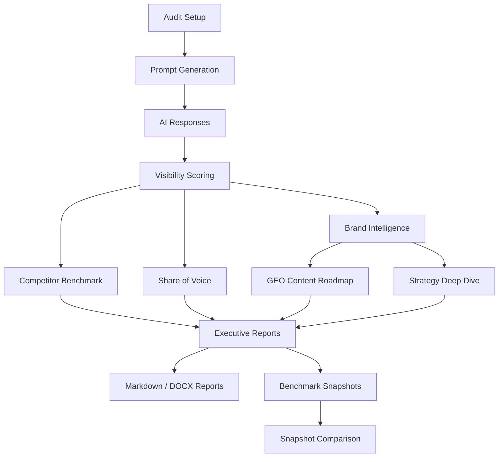

# AI Brand Visibility / GEO Audit Tool

A Streamlit-based AI visibility audit tool for benchmarking how brands appear in AI-generated recommendations.

This project evaluates whether a target brand is visible across high-intent AI recommendation queries, compares it against tracked competitors, calculates visibility metrics such as mentions and share of voice, and generates exportable strategy reports for Generative Engine Optimization (GEO).

The tool started from a real brand-analysis use case and was later generalized into a reusable audit workflow for different brands, categories, markets, audiences, and competitor sets.

---

## Overview

AI-generated recommendations are becoming an important discovery channel for brands. Traditional SEO tools do not fully explain how brands appear inside LLM-generated answers, comparison prompts, or recommendation lists.

This project explores how AI visibility can be measured, benchmarked, and translated into practical strategy recommendations. It combines product thinking, LLM workflow design, benchmark scoring, report automation, and output quality control.

The project is designed as an **AI visibility / GEO audit prototype**, not as a traditional SEO report generator.

---

## Dashboard Preview

The Streamlit interface supports configurable brand audits, competitor benchmarking, visibility scoring, GEO content recommendations, and exportable strategy reports.


> Note: The app is designed to run locally because it requires an OpenAI API key.

---

## What This Project Does

The tool helps answer questions such as:

- Is a target brand mentioned in AI-generated recommendations?
- Which competitors are more visible?
- Which query types does the target brand fail to appear in?
- What associations and trust signals do AI systems currently connect with competitors?
- What content and positioning actions could improve future AI visibility?
- How does visibility change across benchmark snapshots over time?

---

## Project Outputs

The tool can generate:

- AI visibility scorecards
- Competitor benchmark tables
- Share of Voice analysis
- Brand Intelligence findings
- GEO Content Roadmap recommendations
- Markdown executive reports
- DOCX executive reports
- Benchmark snapshot JSON files
- Snapshot comparison outputs
- Output quality validation checks

---

## Key Features

### AI Recommendation Benchmark

Runs prompt-based tests across recommendation, comparison, local-intent, and decision-stage query types.

### Brand Visibility Scoring

Tracks total mentions, average visibility score, prompts visible, and share of voice.

### Competitor Benchmarking

Compares the target brand against a configurable set of tracked competitors.

### Share of Voice Analysis

Calculates how much of the AI recommendation space is captured by each tracked brand.

### Brand Intelligence Module

Extracts recommendation drivers, competitor-owned associations, market signals, positioning gaps, and recurring trust signals from AI-generated responses.

### GEO Content Roadmap

Generates prioritized content recommendations mapped to query intent, target association, evidence needed, and expected benchmark impact.

### Exportable Reports

Produces Markdown and DOCX executive reports for review and presentation.

### Benchmark Snapshots

Supports JSON snapshot export and comparison for tracking changes over time.

### Output Quality Validation

Includes sanitation and validation logic to reduce raw LLM errors, malformed output, unsafe claim wording, and inconsistent report artifacts.

### Regression Test Suite

Includes tests for scoring, report generation, output quality, benchmark snapshots, and export behavior.

---

## Example Use Cases

This tool can be used for:

- AI visibility audits for brands
- GEO / Generative Engine Optimization analysis
- Competitor visibility benchmarking
- Early-stage product or market positioning research
- Consulting-style brand diagnostics
- Tracking whether content improvements increase AI recommendation visibility over time
- Building structured AI visibility reports for internal review or portfolio demonstrations

---

## How It Works

At a high level, the workflow is:

```text
1. User defines target brand, market, category, audience, and competitors
2. The app generates or receives benchmark prompts
3. AI responses are collected and analyzed
4. Brand mentions and ranking signals are scored
5. Share of Voice and visibility metrics are calculated
6. Brand Intelligence and GEO recommendations are generated
7. Output quality checks clean and validate report text
8. Markdown, DOCX, and snapshot exports are generated
```

---

### Workflow Architecture



## Run Modes

### Quick Test Mode

A limited-prompt mode designed for development and QA. It is useful for checking workflow behavior quickly, but it is not intended as a client-ready benchmark.

### Full Report Mode

Runs the full benchmark workflow and generates complete Markdown and DOCX reports. This is the intended mode for portfolio demos and more complete analysis.

---

## Tech Stack

| Area | Technology |
|---|---|
| App interface | Streamlit |
| LLM workflow | OpenAI API |
| Data processing | Python, pandas |
| Visualization | Matplotlib |
| Report generation | Markdown, python-docx |
| Testing | pytest |
| Configuration | `.env` environment variables |
| Version control | Git |

---

## Project Structure

```text
ai-brand-visibility-geo-audit/
|
|-- app.py                         # Streamlit UI and workflow orchestration entrypoint
|-- src/
|   `-- geo_audit/                 # Core audit package
|       |-- __init__.py
|       |-- analysis_pipeline.py    # Benchmark execution and analysis pipeline
|       |-- analyzer.py             # AI request wrapper
|       |-- scoring.py              # Visibility scoring and share-of-voice logic
|       |-- prompt_generator.py     # Prompt generation
|       |-- prompts.py              # Core prompt templates
|       |-- narrative_prompts.py    # Narrative report prompt templates
|       |-- brand_intelligence.py   # Brand intelligence analysis
|       |-- geo_roadmap.py          # GEO content roadmap generation
|       |-- report_generator.py     # DOCX executive report export
|       |-- markdown_report.py      # Markdown executive report export
|       |-- output_quality.py       # Output sanitation and validation layer
|       `-- ...                     # Additional package helpers and export modules
|
|-- tests/                         # Regression and unit tests
|-- docs/                          # Screenshots and documentation assets
|   `-- dashboard-preview.png
|
|-- .env.example                   # Environment variable template
|-- .gitignore
|-- requirements.txt
`-- README.md
```

---

## Run Locally

### 1. Clone the repository

```bash
git clone https://github.com/Godric1201/ai-brand-visibility-geo-audit.git
cd ai-brand-visibility-geo-audit
```

### 2. Create and activate a virtual environment

```bash
python -m venv .venv
```

Windows PowerShell:

```powershell
.venv\Scripts\Activate.ps1
```

macOS / Linux:

```bash
source .venv/bin/activate
```

### 3. Install dependencies

```bash
pip install -r requirements.txt
```

### 4. Add your OpenAI API key

Create a local `.env` file based on `.env.example`.

Windows PowerShell:

```powershell
copy .env.example .env
```

macOS / Linux:

```bash
cp .env.example .env
```

Then add your API key to `.env`:

```env
OPENAI_API_KEY=your_api_key_here
```

Do not commit `.env` to GitHub.

### 5. Start the Streamlit app

```bash
streamlit run app.py
```

---

## Testing

Run the full test suite:

```bash
python -m pytest tests -q
```

The test suite covers benchmark logic, output quality validation, report generation, snapshot handling, and export behavior.

---

## Additional Documentation

- [Usage Guide](docs/usage-guide.md)
- [Output Examples](docs/output-examples.md)
- [Changelog](CHANGELOG.md)

## Outputs

The tool can generate several types of outputs:


### Executive Reports

- Markdown executive report
- DOCX executive report

### Benchmark Artifacts

- Benchmark snapshot JSON
- Benchmark comparison output
- Share of Voice tables
- Visibility scoring summaries

### Strategy Artifacts

- Brand Intelligence analysis
- GEO Content Roadmap
- AI Visibility Strategy Deep Dive
- Strategic priorities and measurement recommendations

---

## Demo / Example Output

A typical generated report includes:

- Executive Summary
- Competitive Benchmark
- Trigger-Level Visibility Findings
- Strategic Priorities
- GEO Content Roadmap
- Measurement Plan
- Brand Intelligence Appendix
- AI Visibility Strategy Deep Dive

For portfolio review, exported reports should be treated as example diagnostic outputs rather than client-confidential deliverables.

---

## Output Quality System

Because LLM-generated reports can be inconsistent, the project includes a centralized output quality layer.

The validation system checks for:

- Raw API or connection error leakage
- Malformed claim-safety wording
- Unsupported numeric targets in Quick Test Mode
- Non-brand items appearing as AI-discovered brands
- Source-label formatting artifacts
- Inconsistent report wording
- DOCX / Markdown export issues

This layer was built to make the tool more reliable as a product-style reporting workflow rather than a simple demo.

---

## Limitations

This is a product prototype, not a production SaaS platform.

Current limitations:

- Results depend on LLM responses and may vary between runs.
- The tool measures AI answer visibility, not actual sales, revenue, or market share.
- Outputs should be interpreted as diagnostic signals, not definitive market research.
- Batch reporting is not yet implemented.
- API usage costs depend on benchmark size and selected report mode.
- A hosted demo is not currently provided because the app requires a private API key.

---

## Portfolio Context

This project was built as a portfolio project to demonstrate:

- Product-oriented problem solving
- AI workflow design
- Python and Streamlit development
- Benchmark and scoring logic
- Report automation
- Testing and regression coverage
- Output quality control
- Ability to move from rough prototype toward a more product-grade tool

---

## Status

Current status: **portfolio-ready product prototype**.

Planned future improvements:

- Batch audit mode for multiple brands
- More structured project configuration files
- Cleaner separation between deterministic report logic and LLM-generated narrative
- Additional example datasets and screenshots
- Optional hosted demo version
- More structured example reports for non-confidential portfolio review
- Cleaner `src/` package structure for long-term maintainability